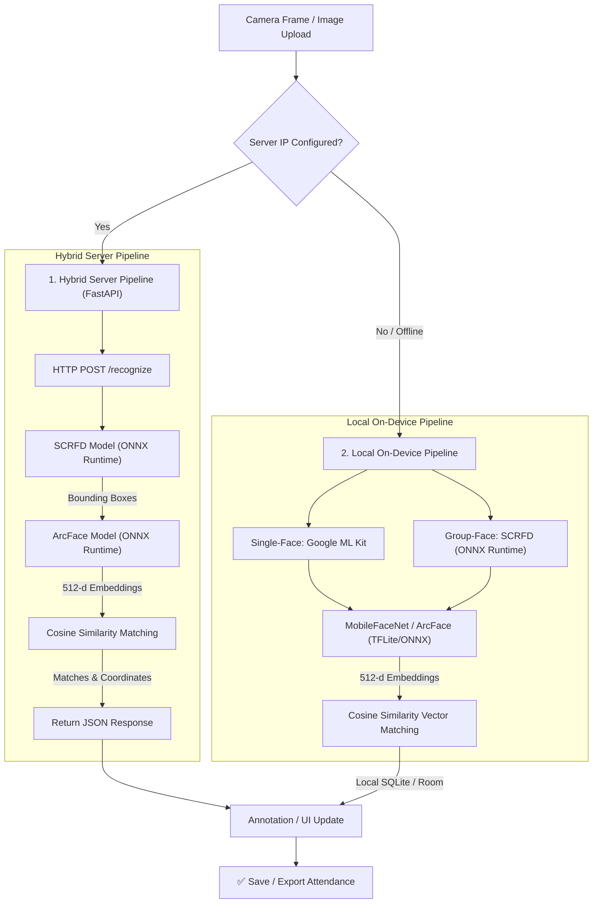

# 📸 Smart Face Attendance System (Hybrid & 100% Offline)

A professional, state-of-the-art **Face Recognition-based Smart Attendance Application** for Android, featuring a hybrid architecture that seamlessly transitions between **100% offline, on-device deep learning execution** and high-throughput **local FastAPI Python server acceleration**.

The system utilizes advanced deep learning models to detect, extract, and match facial signatures against a secure database, allowing teachers and administrators to perform real-time, high-accuracy, single-face and group-face attendance with zero cloud latency and complete data privacy.

---

## 🚀 Key Features

*   **🏫 Class Session Hub:** Create, manage, and track attendance session-wise (e.g., "Mathematics", "Science Lab"). Active present counts are updated live on custom card views.
*   **👤 One-Shot Face Registration:** Enroll a student once by filling in details and capturing their face. The system automatically computes and saves their unique 512-dimensional facial signature.
*   **📸 Real-Time Face Scanner:** Real-time camera preview equipped with a custom-engineered scanning overlay (`FaceOverlayView`) that renders dynamic target brackets around detected faces.
*   **👥 Group Face Recognition (Batch Mode):** Select a class photo or capture a live image of a group. The system automatically detects and recognizes multiple faces simultaneously, labeling them "Present" or "Unknown".
*   **⚙️ Hybrid Server Acceleration:** A fully-integrated Python backend (`server.py`) using FastAPI, SQLite, and ONNX Runtime to offload group processing for maximum efficiency and speed.
*   **🔌 Automated Server Fallback:** Configurable server IP. If the Python server is unreachable or unconfigured, the Android client automatically falls back to the fully local, on-device ONNX/TFLite engine.
*   **🗄️ Robust SQLite Persistence:** Dual database architecture—Room Database (SQLite) for Android and SQLite for the Python backend with persistent storage.
*   **📊 Attendance History & Sharing:** Browse complete logs color-coded by status (Present vs. Unknown) with corresponding confidence percentages and export reports directly to Downloads or external sharing services.
*   **🛠️ Student Management Dashboard:** Browse enrolled students, edit details, or remove records directly from the app interface.

---

## 🧠 System Architecture & Deep Learning Pipeline

The application features a flexible, hybrid machine learning pipeline:



### 1. Face Detection
*   **Real-time Scanner:** Configured with Google ML Kit `PERFORMANCE_MODE_ACCURATE` to ensure precise tracking of facial landmarks and bounding boxes, even at slight angles.
*   **Group Mode (SCRFD):** Utilizes the state-of-the-art **SCRFD detector** (`det_500m.onnx` from the InsightFace buffalo_sc model pack). Optimized for high-resolution grids (**960×960 input**), allowing the system to detect extremely small or distant faces in crowded classrooms.

### 2. Deep Feature Extraction (Face Recognition)
*   **MobileFaceNet / ArcFace:** Generates a compact, L2-normalized **512-dimensional vector (embedding)** representing distinct facial landmarks.
*   **Model Options:**
    *   `mobilefacenet.tflite` (~5MB): Ultra-lightweight model optimized for Android CPU/GPU execution.
    *   `w600k_mbf.onnx` (~16MB): High-accuracy ONNX version of MobileFaceNet deployed both locally on-device and on the server.

### 3. Classification (Cosine Similarity Vector Matching)
*   Calculates the Dot Product of two L2-normalized embeddings:
    $$\text{Similarity} = \vec{A} \cdot \vec{B}$$
*   **Strict Thresholding:**
    *   **Single-Face Offline:** `0.60` threshold (highly strict to prevent false positives).
    *   **Group-Face:** `0.30` threshold (optimized to handle compression, distance, and varying angles in wide group photos).

---

## 📁 Directory Structure

```
. (Root Directory)
├── server.py                        # FastAPI Python server
├── run_server.bat                   # Batch script to launch Python server easily
├── server_faces.db                  # Python server persistent SQLite DB (Auto-generated)
├── app/src/main/java/com/example/facedetectionapp/
│   ├── MainActivity.java            # Redirects launcher to Dashboard
│   ├── db/
│   │   ├── AppDatabase.java         # Room SQLite singleton & Migrations
│   │   ├── StudentEntity.java       # Student table schema
│   │   ├── AttendanceEntity.java    # Attendance logs table schema
│   │   ├── ClassSessionEntity.java  # Class sessions table schema
│   │   ├── StudentDao.java          # Student DB query interface
│   │   ├── AttendanceDao.java       # Attendance DB query interface
│   │   ├── ClassSessionDao.java     # Class session DB query interface
│   │   └── Converters.java          # Serializes float[] to JSON for SQLite
│   ├── ml/
│   │   ├── ArcFaceModel.java        # TFLite/ONNX ArcFace wrapper
│   │   ├── FaceAligner.java         # Facial crop and alignment utilities
│   │   ├── FaceMatcher.java         # Cosine similarity calculations
│   │   ├── FaceServerClient.java    # HTTP client for interacting with Python FastAPI server
│   │   ├── InsightFaceDetector.java # SCRFD face detector using ONNX Runtime
│   │   ├── InsightFaceRecognizer.java # ArcFace/MobileFaceNet recognizer using ONNX Runtime
│   │   └── MobileFaceNetModel.java  # TFLite MobileFaceNet wrapper
│   ├── repository/
│   │   └── AttendanceRepository.java # Thread-safe database handlers
│   └── ui/
│       ├── DashboardActivity.java   # Main home stats dashboard
│       ├── RegisterActivity.java    # Face enrollment screen
│       ├── ClassSessionActivity.java # Class session manager
│       ├── AttendanceActivity.java  # Real-time single-face scanner
│       ├── GroupAttendanceActivity.java # Real-time/static group face scanner (Hybrid/Offline)
│       ├── ManageStudentsActivity.java  # Student manager (view, delete, edit)
│       ├── HistoryActivity.java     # Attendance logs viewer
│       └── overlay/
│           └── FaceOverlayView.java # Custom canvas scanning animation
└── app/src/main/assets/
    ├── det_500m.onnx                # SCRFD Detection ONNX Model (~2.5MB)
    └── w600k_mbf.onnx               # MobileFaceNet/ArcFace ONNX Model (~13.6MB)
```

---

## ⚙️ Hybrid Server Setup & Run Guide

To run the group-face recognition with server-side acceleration:

### Prerequisites
*   **Python 3.8** or higher installed.
*   Required model assets in the `app/src/main/assets` directory.

### 1. Install Dependencies
Open a terminal in the project root directory and run:
```bash
pip install fastapi uvicorn opencv-python numpy onnxruntime pydantic python-multipart
```

### 2. Start the FastAPI Server
You can launch the server by double-clicking `run_server.bat` or by running the following command in your terminal:
```bash
python server.py
```
The server will start at `http://0.0.0.0:8000`.

> [!NOTE]
> When the server starts, it will automatically load `det_500m.onnx` and `w600k_mbf.onnx` directly from the Android assets folder (`app/src/main/assets`) and initialize `server_faces.db` to store student embeddings.

### 3. FastAPI Endpoint Documentation
Once running, you can explore and test the interactive API documentation at:
*   Swagger UI: `http://localhost:8000/docs`
*   ReDoc: `http://localhost:8000/redoc`

| Endpoint | Method | Form Parameters | Description |
| :--- | :--- | :--- | :--- |
| `/register` | `POST` | `student_id`, `name`, `roll_number`, `class_name`, `file` (Image) | Extracts facial features and registers a student. |
| `/recognize` | `POST` | `file` (Image), `threshold` (default: 0.30) | Detects all faces and returns matches with bounding boxes. |
| `/clear_db` | `POST` | None | Deletes all registered students from the server database. |

---

## 🧠 Included Machine Learning Models

The required deep learning model files are pre-packaged and included directly in this repository:

| File | Path | Size | Purpose |
| :--- | :--- | :--- | :--- |
| `det_500m.onnx` | `app/src/main/assets/det_500m.onnx` | ~2.5 MB | SCRFD Face Detector |
| `w600k_mbf.onnx` | `app/src/main/assets/w600k_mbf.onnx` | ~13.6 MB | ArcFace Recognizer |

---

## 📱 Android Client Setup & Configuration

### Prerequisites
*   Android Studio **Koala** or newer.
*   Android Device or Emulator running **Android 7.0 (API Level 24)** or higher.
*   Front-facing and rear-facing camera.

### Steps to Run
1.  **Open in Android Studio:**
    *   Select **File > Open** and select the root project folder.
    *   Wait for Gradle to download dependencies and sync the project.
2.  **Ensure Model Assets are Present:**
    *   The required models (`det_500m.onnx` and `w600k_mbf.onnx`) are already pre-packaged in the `app/src/main/assets/` folder.
3.  **Build and Run:**
    *   Connect your Android phone via USB (with USB Debugging enabled).
    *   Click the green **Run ▶** button in Android Studio.
    *   Grant **Camera Permission** and **Storage Permission** when prompted.

### Configuring the Hybrid Server in Android App
1.  Open the **Smart Face Attendance System** app on your device.
2.  Navigate to a class session and click on **Group Attendance** (or click the Settings icon if available).
3.  Click the **Server Settings** (gear icon) in the top bar.
4.  Enter the local IP address of your machine running the Python server (e.g. `192.168.1.100`).
5.  Click **Save**. The app will now automatically route all group photo requests through the server.
6.  *To fall back to strictly offline mode, clear the IP input and save.*

---

## 💡 Tips for Maximum Accuracy

*   **Lighting:** Register students in clean, even lighting. Avoid intense backlighting.
*   **Pose:** Keep your head straight, looking directly at the camera at a distance of 30-60cm.
*   **Obstructions:** Keep your face fully visible (avoid sunglasses, face masks, or heavily covering hats).
*   **Group Photos:** Ensure the group photo is taken with high-resolution settings, capturing clean, unblurred faces of all members.

---

## 🛠️ Technologies & Libraries Used

*   **Android App:**
    *   **Core Logic:** Java, Android SDK
    *   **ONNX Runtime Mobile:** `microsoft.onnxruntime:onnxruntime-android:1.18.0`
    *   **Deep Learning Models:** TensorFlow Lite (`2.16.1`)
    *   **Face Detection API:** Google ML Kit Face Detection (`16.1.7`)
    *   **Camera Pipeline:** CameraX (`1.3.4`)
    *   **Database Persistence:** Room Database (`2.6.1`) with SQLite
    *   **Design Framework:** Google Material Design 3 (M3)
    *   **Serialization:** Gson (`2.10.1`)
*   **Python Server:**
    *   **Web Framework:** FastAPI (`0.110.0`)
    *   **ASGI Server:** Uvicorn (`0.28.0`)
    *   **Deep Learning Inference:** ONNX Runtime (`1.17.1`)
    *   **Computer Vision:** OpenCV-Python (`4.9.0`)
    *   **Database:** SQLite3

---

## 📄 License
This project is licensed under the MIT License.
